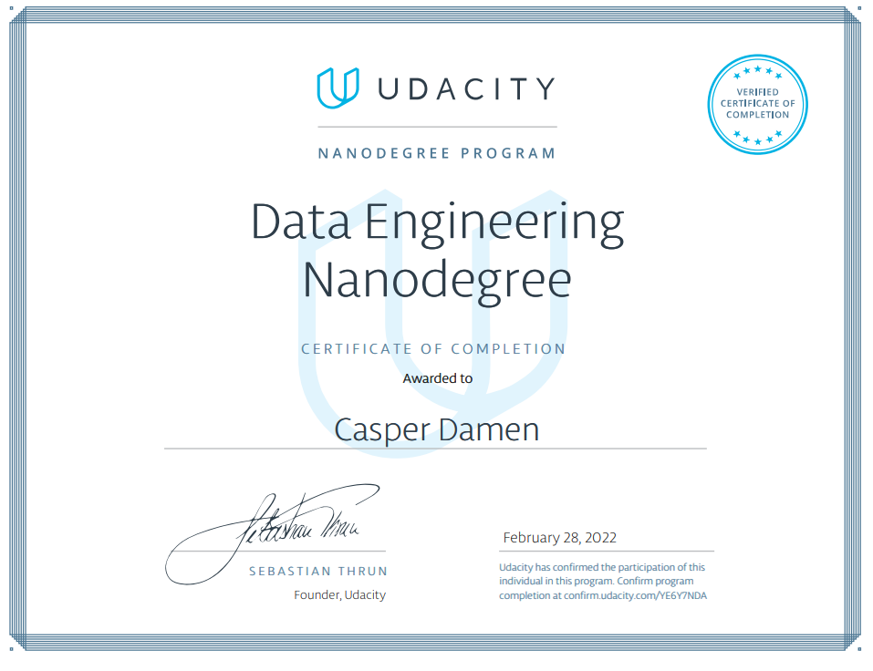

## Data Engineering Nano Degree
This repository contains all code related to the [Data Engineering Nano Degree program](https://www.udacity.com/course/data-engineer-nanodegree--nd027) from Udacity.
Details of the projects can be found in the specific README.md files.

### Project content
1. Data modelling
   - [Introduction](data_modelling/introduction)
   - [Non Relational Databases](data_modelling/non_relational_databases)
   - [Relational Databases](data_modelling/relational_databases)
2. Cloud Data Warehouses
   - [Introduction](cloud_data_warehouses/introduction)
   - [Amazon Web Services](cloud_data_warehouses/aws)
3. Spark Data Lakes
   - [Exercises](spark_data_lakes/exercises)
   - [Project](spark_data_lakes/project)
4. Automate Data Pipelines
   - [Airflow](automating_data_pipelines/airflow)
5. Capstone Project
   - [Project](capstone_project)

### Completion certificate

