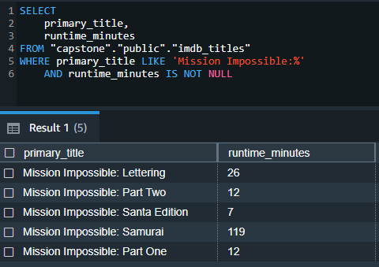
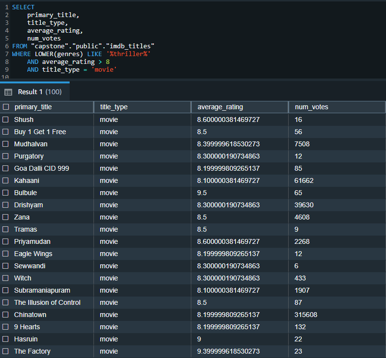
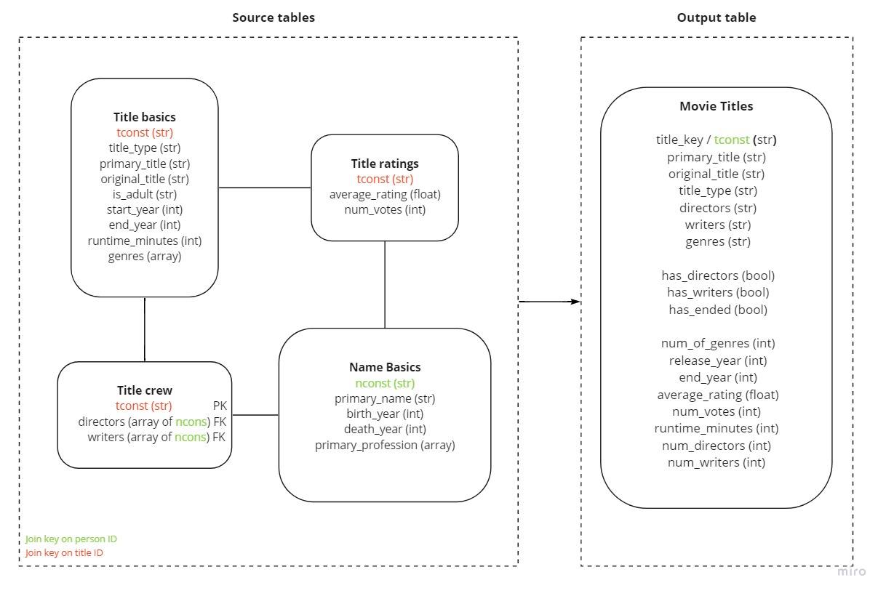
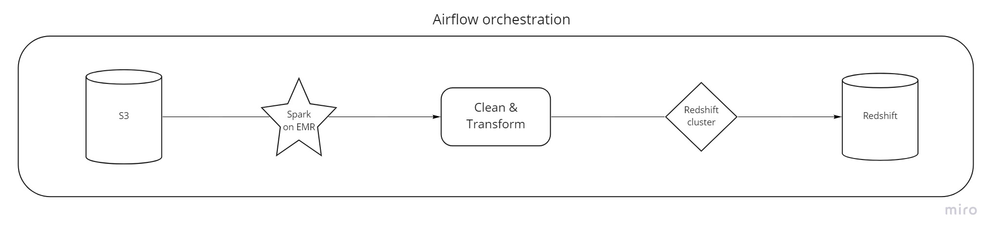
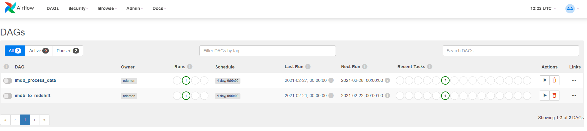
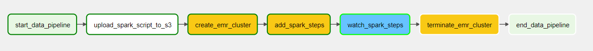
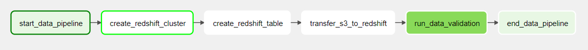

# Project overview
The goal of this project is to generate an analytics table containing relevant information on IMDB movie titles and their ratings.
By combining several tables into one we avoid the need to write complex join queries to find answers to your business questions. The analytics
table generated in this project allows data analyst and other users to find answers to their business questions by executing simple queries to one table that is considered
to be the single source of truth. The second use case would be to use this denormalized dataset for applications that need quick access to basic imdb movie details. 
Since all information is in one place, it is optimized for fast reads.

# Table of content
1. [Data](#data)
   1. [Example requests](#example-requests)
   2. [Schema](#schema)
   3. [Entity Relationship Diagram](#entity-relationship-diagram)
2. [Infrastructure](#infrastructure)
3. [Project instructions](#project-instructions)
   1. [Usage](#usage)
   2. [Folder structure](#folder-structure)
4. [Future scenarios](#future-scenarios)

# Data
The raw data used for this project comes from [IMDB](https://www.imdb.com/interfaces/). Given the large amount of data
and the different data dimensions the information is originally split up in different tables. This means that in order
to gather relevant insights on IMDB titles, one must decide upfront which tables to leverage and join. On the one hand this
provides flexibility and makes sure only the needed data is approached. On the other hand this can result in overhead 
since basic data request will soon involve the need to write relatively complex queries using multiple tables. To avoid this, we combined the most important tables together to provide a quick dataset that can answer most of the basic IMDB 
information needs. In summary, this table will meet two different data needs, it can answer:
1. Aggregated business questions (How many movies where released in 2004?)
2. Detailed movie questions (Who wrote the Ozark series script?)

## Example requests
The following queries serve as inspiration examples on how to leverage the dataset.

_What is the runtime of the different Mission Impossible titles?_

_List 100 thriller movies that have high ratings (8 or higher)_

## Schema 

The following tables are used:
1. `title.crew` - 8.688.756 records 
2. `title.basics` - 584.692 records
3. `title.ratings` - 1.213.990 records
4. `name.basics` - 1.150.584 records

These tables are transformed into the ready for analysis table called `imdb_titles` containing 584.692 records:

| Field          |  Type   |                                                                                                                        Description |
|----------------|:-------:|-----------------------------------------------------------------------------------------------------------------------------------:|
| title_key      |  text   |                                                                                        Alphanumeric unique identifier of the title | 
| primary_title  |  text   | The more popular title / title used by the filmmakers on  promotional materials at the point of release (up to 200 characters) |
| original_title |  text   |                                                                    Original title, in the original language (up to 200 characters) |
| title_type     |  text   |                                                                                                       The type/format of the title |
| directors      | string  |                                                                                Names of title directors separated by ',' (up to 5) |
| writers        | string  |                                                                                  Names of title writers separated by ',' (up to 5) |
| genres         | string  |                                                                  Genres associated with the movie title separated by ',' (up to 3) |
| hasDirectors   | boolean |                                                                    Indicates whether the title has directors (TRUE) or not (FALSE) |
| hasWriters     | boolean |                                                                      Indicates whether the title has writers (TRUE) or not (FALSE) |
| hasEnded       | boolean |                                                                    Indicates whether the TV series has ended (TRUE) or not (FALSE) |
| numOfGenres    | integer |                                                                           The number of different genres associated with the title |
| releaseYear    | integer |                                                                                                                    Year of release |
| endYear        | integer |                                                                                                       Year of ending for TV series |
| averageRating  |  float  |                                                                                Weighted average of all the individual user ratings |
| numVotes       | integer |                                                                                             Number of votes the title has received |
| runtimeMinutes | integer |                                                                                           Primary runtime of the title, in minutes |
| numDirectors   | integer |                                                                                                    Total number of title directors |
| numWriters     | integer |                                                                                                      Total number of title writers |

## Entity Relationship Diagram 
The several source tables that are used can be summarized using the following ERD

# Infrastructure
The raw IMDB data is stored in S3 buckets on Amazon Web Services in TSV files. This allows us to reach the data easily from our Spark script.
We clean this data using Spark given the size of the data. The processing is running on an EMR cluster, so we don't need to worry about the resources needed for the Spark processing.
When the Spark processing is done we close the EMR cluster. After joining the prepared tables, the final Spark DataFrame is written to S3 as a Parquet file, making it available in a generic format for multiple use cases.
The last step is to copy the final table from S3 to a SQL database running on a Redshift cluster.

The orchestration of this pipeline is managed by Airflow which runs in a Docker container. Airflow provides an intuitive overview of the full data pipeline. 
Docker makes the Airflow setup easily transferable and replicable. Different DAGS are used to split up the work in the pipeline.

The first DAG called `imdb_process_data` is used to clean the tables and output the final table to S3.

The second DAG called `imdb_to_redshift` is used to generate the Redshift database and move the final table from S3 to Redshift.

# Project instructions

## Usage
The Airflow instance can be setup in a Docker environment which is run using `docker compose up`. 
Next, the DAGS can be started using the Airflow UI at `localhost:8080`.

The functionalities of the different DAGS are as follows:

__imdb_process_data__
- `start_data_pipeline`: Dummy operator to indicate the pipeline start
- `upload_spark_script_to_s3`: Uploads the pyspark processing script to S3
- `create_emr_cluster`: Creates EMR cluster on AWS to run Spark job
- `add_spark_steps`: Adds the Spark steps to be completed on EMR cluster
- `watch_spark_steps`: Monitors step completion
- `terminate_emr_cluster`: Terminates the EMR cluster
- `end_data_pipeline`: Dummy operator to indicate the pipeline end

__imdb_to_redshift__
- `start_data_pipeline`: Dummy operator to indicate the pipeline start
- `create_redshift_cluster`: Creates Redshift cluster, generates database and sets up Airflow connection
- `create_redshift_table`: Creates table for IMDB titles
- `transfer_s3_to_redshift`: Copies final table from S3 to Redshift database
- `run_data_validation`: Performs data validation tests on final table in Redshift
- `end_data_pipeline`: Dummy operator to indicate the pipeline end

## Folder structure

- `dags`: Airflow DAGS to run the data pipelines
- `dags/script`: Spark script to clean and transform raw tables
- `plugins/helpers`: Generic helper functions
- `plugins/operators`: Custom Airflow operators
- `airflow.cfg`: Configuration file for Airflow containing AWS related configuration variables
- `docker-compose.yaml`: Docker compose file to build Airflow in docker container
- `Dockerfile`: Additional configuration Docker
- `requirements.txt`: Python packages to install on Airflow server

# Future scenarios

__Increasing data__ \
If the data increases over time and would become 100X larger, we would need to up-scale the specs of our EMR cluster. 
In addition it would make sense to process the data in partitions by for example chunking up the movies based on the 
first letter of the title. In terms of storage, the Redshift cluster size can be increased by adding more slave nodes to
do the work for the master node. Partitioning the final table based on the `release_year` will optimize the
filtering options and benefit the query runtime even if the dataset size increases over time.

__Daily runs__ \
When running this pipeline daily, it makes sense to include functionality to only append new titles compared to the 
already existing titles in the database. It is not needed to fully overwrite the table every day. These daily runs will 
enable the business to work with fresh and updated movie details.

Running the pipeline every morning is relatively cheap, it costs about 2 euros to complete. The Redshift cluster however is more expensive to
maintain and keep active so users can query the dataset. This will be around 6 euros per day. 

__Global access__ \
It would be smart to work with user groups if the access need to be provided to a large amount of people. Allowing for
different access rights if needed. Also, it's important to make everyone aware of the freshness of the data. Redshift 
should be able to handle multiple concurrent queries to the database given its scalability. Replicating the data should 
not be needed as the cluster can scale-up if needed. Replication is also less desired when the need for accurate and in-sync data is high. 
he costs of querying will increase as more and more people access the database.